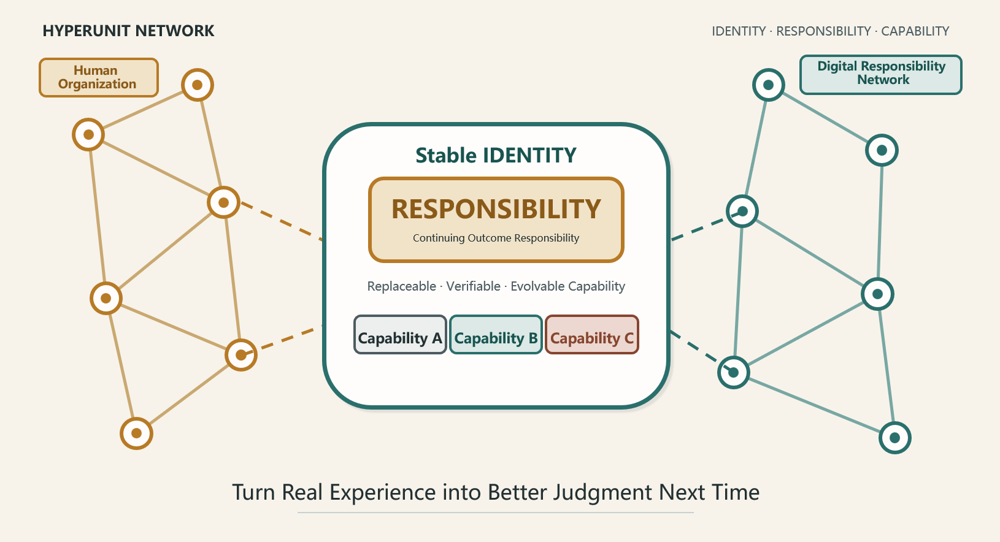

# HyperUnit Network

**English** | [简体中文](./README.zh-CN.md)

HyperUnit Network (超元网络) is a responsibility-centered architecture for capability digitization, digital responsibility networks, decision intelligence, decision traceability, AI governance, organizational learning, data provenance, and reality-validated enterprise AI. It connects human accountability, replaceable capabilities, typed evidence, and real-world outcomes so that organizational judgment can be reviewed, reused, and improved over time.



> **Initial public release:** September 1, 2026
>
> **Author:** Wei Roy Wang · GitHub [@aspttwwly](https://github.com/aspttwwly)
>
> **Release package:** `V0.3` · **White paper:** `v1.2` · **Companion demos:** `V0.3`

## Why HyperUnit Network

Most digital systems are good at storing information, executing workflows, or generating content. They are less effective at preserving who remains responsible, what was known at the time of a decision, which capability produced a result, and whether reality later confirmed or contradicted that judgment.

HyperUnit Network proposes a different unit of organization: a **HyperUnit** has a stable identity and an explicit, continuing **Responsibility**, while its capabilities can be replaced, verified, and evolved. The framework keeps Fact, Configuration, Claim, Decision, Reality Fact, and Evidence distinct, then links them through a closed learning loop:

`Responsibility → Capability → Claim → Human Decision → Execution/Outcome → Reality Fact → Evidence → Improved Capability`

The goal is not to make AI or software automatically authoritative. The goal is to make responsibility, provenance, judgment, and learning inspectable across human and machine collaboration.

## At a Glance

| Dimension | HyperUnit Network approach |
| --- | --- |
| Organizational anchor | Stable HyperUnit identity with continuing outcome responsibility |
| Evolvable layer | Replaceable, verifiable, versioned Capabilities |
| Epistemic discipline | Fact, Claim, Decision, Reality Fact, and Evidence remain distinct |
| Decision accountability | Human confirmation remains explicit where policy requires it |
| Traceability | Dependency and Decision Snapshots preserve decision-time context |
| Learning | Later real-world outcomes feed back into future judgment |
| Portability | Typed artifacts can be inspected by people and machines |
| Current example | Pre-publication validation of weekly bank account balances using synthetic data |

## Repository Contents

| Language | White paper | Interactive companion demo |
| --- | --- | --- |
| English | [HyperUnit Network White Paper v1.2](./HyperUnit_Network_White_Paper_v1.2_EN.docx) | [Weekly Bank Account Balance Validation Demo V0.3](./Pre-Publication_Validation_of_Weekly_Bank_Account_Balances_v0.3.html) |
| Chinese | [超元网络白皮书 v1.2](./超元网络白皮书_正式版_v1.2.docx) | [账户管理演示版 V0.3](./账户管理_超元发布版_V0.3.html) |

Supporting files:

- [Release notes](./RELEASE_NOTES.md) — package scope, validation summary, and boundaries.
- [Citation metadata](./CITATION.cff) — machine-readable citation information.
- [SHA-256 checksums](./SHA256SUMS.txt) — integrity hashes for the four primary artifacts.
- [Security policy](./SECURITY.md) — how to report a security concern privately.

## Core Concepts

| Concept | Meaning in this project |
| --- | --- |
| **HyperUnit** | A stable digital identity that carries an explicit Responsibility and can evolve its Capabilities. |
| **Responsibility** | Continuing accountability for a defined real-world outcome; it is not merely a task assignment. |
| **Capability** | A replaceable, versioned, and testable means of fulfilling part of a Responsibility. |
| **Fact** | An observed or accepted input with provenance; not an interpretation or recommendation. |
| **Claim** | A capability-generated proposition that still requires evaluation under policy. |
| **Decision** | An explicit judgment, including the responsible actor, applicable policy, time, and rationale. |
| **Reality Fact** | A later observation of what actually happened after execution or passage of time. |
| **Evidence** | The trace that connects inputs, dependencies, claims, decisions, and outcomes. |
| **Dependency Snapshot** | A decision-time record of the upstream state on which a claim depends. |
| **Decision Snapshot** | A reviewable record of the decision context rather than only its final answer. |

## Who This Is For

- founders, executives, and transformation leaders designing accountable digital organizations;
- enterprise architects and engineers working on AI agents, workflow systems, provenance, or interoperability;
- risk, audit, governance, and compliance professionals concerned with decision evidence;
- researchers exploring human–AI collaboration, organizational learning, and capability-based systems;
- product and operations teams that need automation without erasing human responsibility.

## Explore the Demo

The bilingual HTML demo turns the white paper's minimum closed loop into a portable example. It includes four fixed synthetic scenarios:

| Scenario | What it demonstrates |
| --- | --- |
| Pass | All validation rules pass and a claim can proceed to human review. |
| Human confirmation | Policy requires an explicit human decision before continuation. |
| Blocked | A blocking exception prevents the proposed action. |
| Stale dependency | An upstream dependency is too old to support a current decision. |

To run it:

1. Clone or download the repository.
2. Keep each Word white paper in the same directory as its corresponding HTML demo so the relative links continue to work.
3. Open the `.docx` file in Microsoft Word or another compatible reader.
4. Open the `.html` file locally in a modern browser. GitHub displays HTML source rather than running it, so the demo must be downloaded or cloned first.

The demo shows the sequence from Dependency Snapshot to Claim, human Decision, simulated Execution/Outcome, Reality Fact, and Evidence. Optional authoring and dynamic-layout tools run only in the current browser session.

## Safety and Governance Boundary

- All account names, balances, roles, times, and outcomes in the demo are synthetic.
- The HTML does not connect to banks, Feishu, ERP systems, APIs, or external network services.
- It does not perform real publication, payment, approval, or system writes.
- A generated Claim is not a Fact and does not automatically become a Decision.
- Opening the HTML in Portable View does not grant Managed Run privileges or write authority.
- The example Manifest is non-normative and does not grant permissions.
- Engineering conformance remains subject to the planned Core Protocol Specification and Technical Companion.

## Project Status and Roadmap

The current release establishes the conceptual framework and a bilingual, inspectable demonstration. The following items are planned and are not yet normative specifications:

- Core Protocol Specification;
- Technical Companion and implementation guidance;
- formal Manifest and Capability contracts;
- Registry, signatures, Runtime governance, Persistence, and interoperability reference work;
- additional domain examples and reality-validation patterns.

Roadmap language expresses intent, not a delivery commitment. Versioned releases will identify which artifacts are normative, illustrative, or experimental.

## Citation

If you discuss or build on the ideas in this work, please cite:

> Wang, Wei Roy. (2026). *HyperUnit Network White Paper: From Information Digitization to Reality-Validated Capability Digitization* (Version 1.2). HyperUnit Network. https://github.com/aspttwwly/hyperunit-network-white-paper

GitHub-compatible citation metadata is available in [CITATION.cff](./CITATION.cff).

## Feedback and Participation

- Use [GitHub Issues](https://github.com/aspttwwly/hyperunit-network-white-paper/issues) for content corrections, broken links, reproducible demo problems, and narrowly scoped implementation questions.
- Use [GitHub Discussions](https://github.com/aspttwwly/hyperunit-network-white-paper/discussions) for conceptual critique, use cases, research questions, and broader design conversation.
- Report security-sensitive findings privately according to [SECURITY.md](./SECURITY.md).

Please distinguish clearly between observations, interpretations, implementation proposals, and claims of protocol conformance.

## Versioning and Integrity

The version numbers describe different artifacts and should not be conflated:

- repository release package: `V0.3`;
- white paper content: `v1.2`;
- companion demos: `V0.3`;
- embedded example Manifest: `0.1-draft` and non-normative;
- example Capability: `prepublish-check@0.1.0`.

Verify the four primary artifacts from the repository root:

```bash
sha256sum -c SHA256SUMS.txt
```

```powershell
Get-Content .\SHA256SUMS.txt | ForEach-Object {
  if ($_ -match '^([0-9a-f]{64})  (.+)$') {
    $expected = $Matches[1]
    $file = $Matches[2]
    $actual = (Get-FileHash -Algorithm SHA256 -LiteralPath $file).Hash.ToLowerInvariant()
    [pscustomobject]@{ File = $file; Valid = ($actual -eq $expected) }
  }
}
```

## Frequently Asked Questions

**Is HyperUnit Network a finished product or deployed protocol?**

No. This release is a white paper and an interactive conceptual demonstration. It does not claim production deployment or protocol conformance.

**Does the demo connect to real banks or enterprise systems?**

No. It is an offline demonstration built with synthetic data and makes no external network calls.

**Is a Claim treated as a Fact?**

No. Preserving that distinction is a central design principle. A Claim remains a proposition until it is evaluated under policy and responsibility.

**Why use a portable HTML demo?**

It makes the example inspectable and easy to run locally. The HTML carrier is not a substitute for governed Runtime, Persistence, Registry, security, or enterprise infrastructure.

**Is this repository open source?**

No. Public readability does not grant an open-source license or permission to reproduce, modify, redistribute, or commercialize the materials.

**When will implementation specifications be available?**

The Core Protocol Specification and Technical Companion are planned future work. No current example should be represented as a normative specification.

## Authorship, Copyright, and Use

- **Author:** Wei Roy Wang
- **GitHub owner:** [@aspttwwly](https://github.com/aspttwwly)
- **Copyright:** © 2026 Wei Roy Wang. All rights reserved.

No open-source license is granted. Do not reproduce, modify, redistribute, publish, commercialize, or represent these materials as a normative protocol specification without prior written permission from Wei Roy Wang and the HyperUnit Network project.
