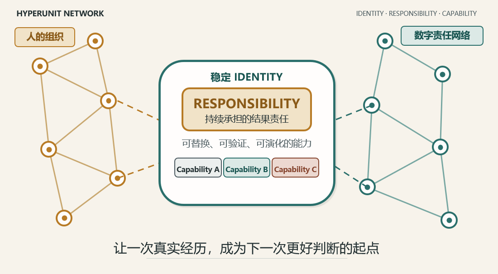

# 超元网络（HyperUnit Network）

[English](./README.md) | **简体中文**

超元网络（HyperUnit Network）是一套以责任为中心的能力数字化架构，面向数字责任网络、决策智能、决策可追溯、AI 治理、组织学习、数据溯源，以及经现实验证的企业智能。它把人的责任、可替换的能力、类型清晰的证据与真实世界的结果连接起来，使组织判断可以被复核、复用，并在实践中持续改进。



> **首次公开发布日期：** 2026 年 9 月 1 日
>
> **作者：** Wei Roy Wang · GitHub [@aspttwwly](https://github.com/aspttwwly)
>
> **发布包：** `V0.3` · **白皮书：** `v1.2` · **配套演示：** `V0.3`

## 为什么需要超元网络

大多数数字系统擅长存储信息、执行流程或生成内容，却不一定能完整保留：谁持续承担结果责任、做出判断时掌握了什么、哪个能力产生了结果，以及后来发生的现实是否验证或推翻了当时的判断。

超元网络提出一种不同的组织单元：一个**超元（HyperUnit）**拥有稳定身份和明确、持续的**责任（Responsibility）**，同时其能力可以被替换、验证和演化。框架严格区分 Fact、Configuration、Claim、Decision、Reality Fact 与 Evidence，并通过以下闭环将它们连接起来：

`责任 → 能力 → 主张 → 人的决策 → 执行/结果 → 现实事实 → 证据 → 改进后的能力`

它的目标不是让 AI 或软件自动获得权威，而是让人机协作中的责任、来源、判断与学习过程都可以被检查和追溯。

## 一览

| 维度 | 超元网络的做法 |
| --- | --- |
| 组织锚点 | 具有稳定身份、持续承担结果责任的超元 |
| 可演化层 | 可替换、可验证、可版本化的能力 |
| 认知边界 | Fact、Claim、Decision、Reality Fact、Evidence 保持清晰区分 |
| 决策责任 | 在政策要求处保留明确的人工确认与责任主体 |
| 可追溯性 | 以依赖快照和决策快照保留决策发生时的上下文 |
| 组织学习 | 将后续真实结果反馈到下一次判断与能力改进中 |
| 可移植性 | 类型明确的工件可被人和机器共同检查 |
| 当前示例 | 使用合成数据进行每周银行账户余额发布前校验 |

## 仓库内容

| 语言 | 白皮书 | 交互式配套演示 |
| --- | --- | --- |
| 中文 | [超元网络白皮书 v1.2](./超元网络白皮书_正式版_v1.2.docx) | [账户管理演示版 V0.3](./账户管理_超元发布版_V0.3.html) |
| English | [HyperUnit Network White Paper v1.2](./HyperUnit_Network_White_Paper_v1.2_EN.docx) | [Weekly Bank Account Balance Validation Demo V0.3](./Pre-Publication_Validation_of_Weekly_Bank_Account_Balances_v0.3.html) |

辅助文件：

- [发布说明](./RELEASE_NOTES.md)：发布范围、验证结果与适用边界。
- [引用元数据](./CITATION.cff)：便于 GitHub 和文献工具识别的引用信息。
- [仓库文件 SHA-256 校验值](./SHA256SUMS.txt)：使用仓库内文件名的完整性哈希。
- [Release 附件 SHA-256 校验值](./RELEASE_ASSET_SHA256SUMS.txt)：同一组哈希，使用便于下载的 `EN` / `ZH-CN` 文件名。
- [安全策略](./SECURITY.md)：私下报告安全问题的方式。

## 核心概念

| 概念 | 在本项目中的含义 |
| --- | --- |
| **HyperUnit / 超元** | 承载明确责任、拥有稳定数字身份、同时可以演化其能力的单元。 |
| **Responsibility / 责任** | 对已定义现实结果的持续承担，而不只是一次任务分配。 |
| **Capability / 能力** | 履行部分责任的可替换、可版本化、可测试方式。 |
| **Fact / 事实** | 具有来源的观察或已接受输入，不等同于解释或建议。 |
| **Claim / 主张** | 由能力生成、仍需按政策进行评估的命题。 |
| **Decision / 决策** | 对判断主体、适用政策、时间和理由的明确记录。 |
| **Reality Fact / 现实事实** | 执行之后或时间推移后，对真实发生结果的观察。 |
| **Evidence / 证据** | 连接输入、依赖、主张、决策与现实结果的可追溯记录。 |
| **Dependency Snapshot / 依赖快照** | 记录形成主张时所依赖的上游状态。 |
| **Decision Snapshot / 决策快照** | 保存可复核的决策上下文，而不只保留最终答案。 |

## 适合哪些读者

- 设计责任清晰的数字化组织的创始人、管理者与转型负责人；
- 研究 AI Agent、工作流、数据溯源或互操作性的企业架构师与工程师；
- 关注决策证据的风险、审计、治理与合规专业人士；
- 研究人机协作、组织学习和能力型系统的学者与研究者；
- 希望推进自动化、同时保留人的责任边界的产品与运营团队。

## 体验演示

中英文 HTML 演示把白皮书中的最小闭环转化为一个可移植、可检查的实例，其中包含四个固定的合成场景：

| 场景 | 展示内容 |
| --- | --- |
| 通过 | 所有校验规则通过，主张可以进入人工复核。 |
| 需要人工确认 | 政策要求在继续之前记录明确的人类决策。 |
| 阻断 | 阻断性异常使拟议操作不能继续。 |
| 上游依赖过期 | 上游信息已经过时，无法支持当前决策。 |

运行方式：

1. 克隆或下载本仓库。
2. 将每份 Word 白皮书与其对应的 HTML 演示保留在同一目录中，以保证相对链接有效。
3. 使用 Microsoft Word 或其他兼容阅读器打开 `.docx` 文件。
4. 使用现代浏览器在本地打开 `.html` 文件。GitHub 只展示 HTML 源码，不直接运行页面，因此需要先下载或克隆。

演示呈现从 Dependency Snapshot、Claim、人的 Decision，到模拟 Execution/Outcome、Reality Fact 与 Evidence 的完整顺序。可选的编排与动态布局功能仅在当前浏览器会话中运行。

## 安全与治理边界

- 演示中的账户名称、余额、角色、时间和结果全部为合成数据。
- HTML 不连接银行、飞书、ERP、API 或任何外部网络服务。
- 演示不会执行真实发布、付款、审批或系统写入。
- 生成的 Claim 不是 Fact，也不会自动成为 Decision。
- 在 Portable View 中打开 HTML 不会获得 Managed Run 权限或写入权限。
- 示例 Manifest 不是规范性文件，也不会授予权限。
- 工程一致性仍以未来的 Core Protocol Specification 与 Technical Companion 为准。

## 项目状态与路线图

当前版本提供概念框架和一个中英文、可检查的配套演示。以下内容属于规划方向，尚不是规范性规格：

- Core Protocol Specification；
- Technical Companion 与实施指南；
- 正式的 Manifest 和 Capability 合约；
- Registry、签名、Runtime 治理、Persistence 与互操作性参考实现；
- 更多领域案例与现实验证模式。

路线图表达的是方向，不构成交付承诺。后续版本将明确标注哪些工件属于规范、示例或实验。

## 引用方式

如果您讨论或基于本项目中的思想开展工作，建议引用：

> Wang, Wei Roy. (2026). *HyperUnit Network White Paper: From Information Digitization to Reality-Validated Capability Digitization* (Version 1.2). HyperUnit Network. https://github.com/aspttwwly/hyperunit-network-white-paper

仓库同时提供 GitHub 可识别的 [CITATION.cff](./CITATION.cff)。

## 反馈与交流

- 使用 [GitHub Issues](https://github.com/aspttwwly/hyperunit-network-white-paper/issues) 报告内容错误、失效链接、可复现的演示问题或范围明确的实施问题。
- 使用 [GitHub Discussions](https://github.com/aspttwwly/hyperunit-network-white-paper/discussions) 讨论概念、应用场景、研究问题和更广泛的设计意见。
- 涉及安全的问题请按照 [SECURITY.md](./SECURITY.md) 私下报告。

提交反馈时，请明确区分观察、解释、实施建议，以及对协议一致性的主张。

## 版本与完整性

以下版本号对应不同工件，请勿混用：

- 仓库发布包：`V0.3`；
- 白皮书内容：`v1.2`；
- 配套演示：`V0.3`；
- 内嵌示例 Manifest：`0.1-draft`，非规范性；
- 示例 Capability：`prepublish-check@0.1.0`。

在仓库根目录使用 `SHA256SUMS.txt` 验证四个主要工件；如果从 [GitHub Releases](https://github.com/aspttwwly/hyperunit-network-white-paper/releases/tag/v0.3) 下载了带语言标记的附件，请改用 `RELEASE_ASSET_SHA256SUMS.txt`。

```bash
sha256sum -c SHA256SUMS.txt
```

```powershell
Get-Content .\SHA256SUMS.txt | ForEach-Object {
  if ($_ -match '^([0-9a-f]{64})  (.+)$') {
    $expected = $Matches[1]
    $file = $Matches[2]
    $actual = (Get-FileHash -Algorithm SHA256 -LiteralPath $file).Hash.ToLowerInvariant()
    [pscustomobject]@{ File = $file; Valid = ($actual -eq $expected) }
  }
}
```

## 常见问题

**超元网络是已经完成的产品或已经部署的协议吗？**

不是。本次发布是白皮书和交互式概念演示，并不声称已经生产部署或符合某个正式协议。

**演示会连接真实银行或企业系统吗？**

不会。演示离线运行，只使用合成数据，不发起外部网络请求。

**Claim 会被当作 Fact 吗？**

不会。保持这一边界是核心设计原则。Claim 在经过政策与责任主体评估之前，始终只是一个待判断的命题。

**为什么采用可移植 HTML 演示？**

因为它便于本地运行与检查。但 HTML 载体不能替代受治理的 Runtime、Persistence、Registry、安全控制或企业基础设施。

**本仓库是开源项目吗？**

不是。公开可读不等于授予开源许可，也不代表允许复制、修改、再分发或商业使用。

**实施规格何时发布？**

Core Protocol Specification 与 Technical Companion 属于后续规划。当前任何示例都不应被表述为正式规范。

## 作者、版权与使用

- **作者：** Wei Roy Wang
- **GitHub 所有者：** [@aspttwwly](https://github.com/aspttwwly)
- **版权：** © 2026 Wei Roy Wang。保留所有权利。

本仓库不授予开源许可。未经 Wei Roy Wang 与 HyperUnit Network 项目事先书面许可，不得复制、修改、再分发、出版、商业化使用这些材料，也不得将其表述为正式协议规范。
